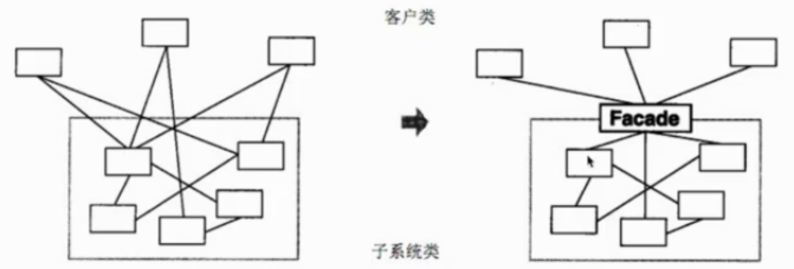
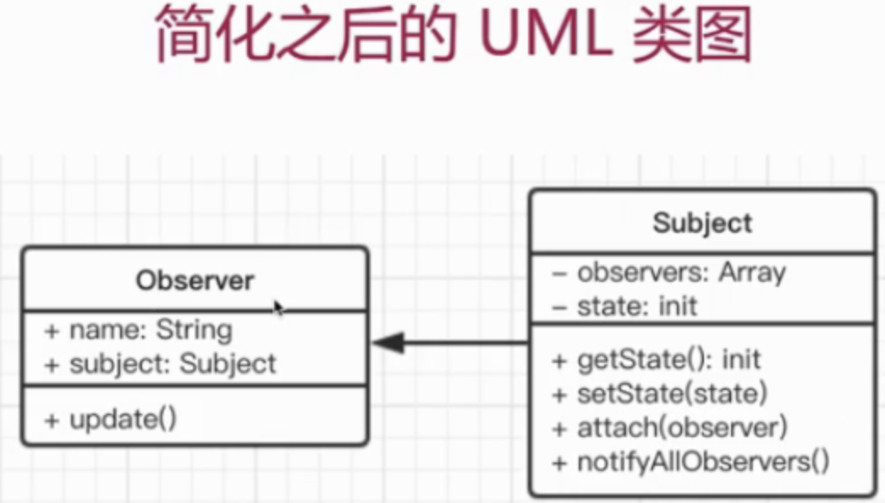

# js设计模式 学习笔记

<!-- TOC -->

- [js设计模式 学习笔记](#js设计模式-学习笔记)
  - [前言](#前言)
    - [论工程师的设计能力](#论工程师的设计能力)
    - [课程概述](#课程概述)
  - [面向对象](#面向对象)
    - [搭建开发环境](#搭建开发环境)
    - [什么是面向对象](#什么是面向对象)
    - [面向对象 - 继承](#面向对象---继承)
    - [面向对象 - 封装](#面向对象---封装)
      - [3个关键字](#3个关键字)
      - [封装特点](#封装特点)
    - [面向对象 - 多态](#面向对象---多态)
      - [多态特点](#多态特点)
    - [面向对象 - 应用举例](#面向对象---应用举例)
    - [面向对象 - 总结](#面向对象---总结)
      - [为何使用面向对象?](#为何使用面向对象)
    - [UML类图](#uml类图)
      - [画图工具](#画图工具)
      - [类图介绍](#类图介绍)
      - [关系](#关系)
    - [总结](#总结)
  - [设计原则](#设计原则)
    - [设计原则介绍](#设计原则介绍)
    - [设计原则-何为设计](#设计原则-何为设计)
      - [《UNIX/LINUX设计哲学》简要介绍](#unixlinux设计哲学简要介绍)
      - [设计哲学书中小准则](#设计哲学书中小准则)
      - [演示下沉默是金和让每个程序都称为过滤器](#演示下沉默是金和让每个程序都称为过滤器)
    - [设计原则-5大设计原则SOLID](#设计原则-5大设计原则solid)
    - [用promise代码演示](#用promise代码演示)
    - [设计模式简介](#设计模式简介)
      - [从设计到模式](#从设计到模式)
    - [23种设计模式介绍](#23种设计模式介绍)
      - [分优先级](#分优先级)
    - [面试真题(面向对象设计能力相关)](#面试真题面向对象设计能力相关)
      - [第1题](#第1题)
      - [第2题](#第2题)
  - [- **层类**：接受层数和车位数据来初始化当前层的实例，需要具备提供当前层空余车位的数量 ----> 需关联车位类以数组型车位类实例作为层类参数，作为内部值引用 提供外界可调用的访问当前层空余车位的方法](#--层类接受层数和车位数据来初始化当前层的实例需要具备提供当前层空余车位的数量------需关联车位类以数组型车位类实例作为层类参数作为内部值引用-提供外界可调用的访问当前层空余车位的方法)
  - [工厂模式](#工厂模式)
    - [介绍](#介绍)
    - [-UML类图](#-uml类图)
    - [演示场景](#演示场景)
      - [适用场景](#适用场景)
      - [两句题外话](#两句题外话)
    - [设计原则验证](#设计原则验证)
  - [单例模式](#单例模式)
    - [介-绍](#介-绍)
      - [示例](#示例)
    - [演示](#演示)
    - [场景](#场景)
    - [-设计原则验证](#-设计原则验证)
  - [适配器模式](#适配器模式)
    - [-介绍](#-介绍)
    - [代码演示](#代码演示)
    - [-场景](#-场景)
      - [封装旧接口](#封装旧接口)
      - [vue的computed](#vue的computed)
    - [设计-原则验证](#设计-原则验证)
  - [装饰器模式](#装饰器模式)
    - [介绍-](#介绍-)
      - [类图](#类图)
      - [-代码演示](#-代码演示)
    - [场景一：ES7装饰器](#场景一es7装饰器)
      - [配置环境](#配置环境)
      - [装饰类](#装饰类)
      - [装饰方法](#装饰方法)
    - [场景二：core-decorators](#场景二core-decorators)
    - [--设计原则验证](#--设计原则验证)
  - [代理模式](#代理模式)
    - [介-绍-](#介-绍-)
      - [示-例](#示-例)
    - [演-示](#演-示)
    - [场景1 js事件代理](#场景1-js事件代理)
    - [场景2 $.proxy](#场景2-proxy)
    - [场景3 ES6 Proxy](#场景3-es6-proxy)
    - [设计原则-验证](#设计原则-验证)
    - [其他模式对比](#其他模式对比)
      - [代理模式 VS 适配器模式](#代理模式-vs-适配器模式)
      - [代理模式 VS 装饰器器模式](#代理模式-vs-装饰器器模式)
  - [外观模式](#外观模式)
    - [介绍--](#介绍--)
    - [场景-](#场景-)
    - [设计原-则验证](#设计原-则验证)
  - [观察者模式 👊](#观察者模式-)
    - [介=绍](#介绍-1)
      - [示=例](#示例-1)
    - [场景1 网页事件绑定](#场景1-网页事件绑定)
    - [场景2 Promise](#场景2-promise)
    - [场景3 jQuery callbacks](#场景3-jquery-callbacks)
    - [场景4 ndoejs自定义事件](#场景4-ndoejs自定义事件)
    - [其他场景](#其他场景)
    - [设=计原则验证](#设计原则验证-1)
  - [迭代器模式](#迭代器模式)
    - [介绍=](#介绍-2)
      - [示==例](#示例-2)
    - [演示=](#演示-1)
    - [场景1 jQuery 的 each封装](#场景1-jquery-的-each封装)
    - [场景2 ES6 Iterator](#场景2-es6-iterator)
      - [ES6 Iterator 为何存在](#es6-iterator-为何存在)
      - [ES6 Iterator 是什么](#es6-iterator-是什么)
      - [迭代器进化-代码展现](#迭代器进化-代码展现)
    - [ES6 Iterator 与 Generator](#es6-iterator-与-generator)
    - [设计原则验证==](#设计原则验证-2)
  - [状态模式](#状态模式)
    - [介绍==](#介绍-3)
      - [模拟场景](#模拟场景)
    - [场景1 有限状态机](#场景1-有限状态机)
      - [特征](#特征)
    - [场景2 写一个promise](#场景2-写一个promise)
      - [分析如何写promise](#分析如何写promise)
      - [Promise就是有限状态机](#promise就是有限状态机)
    - [设计原=则验证](#设计原则验证-3)
  - [其他设计模式](#其他设计模式)
    - [原型模式](#原型模式)
      - [对比JS中的原型prototype](#对比js中的原型prototype)
    - [桥接模式](#桥接模式)
      - [设计原--则验证](#设计原--则验证)
    - [组合模式](#组合模式)
    - [享元模式](#享元模式)
    - [策略模式](#策略模式)
    - [模版方法模式](#模版方法模式)
    - [职责链模式](#职责链模式)
    - [命令模式](#命令模式)
    - [备忘录模式](#备忘录模式)
    - [中介者模式](#中介者模式)
    - [访问者模式](#访问者模式)
    - [解释器模式](#解释器模式)
    - [关于面试和日程应用](#关于面试和日程应用)
  - [综合应用](#综合应用)
    - [UML类图分析](#uml类图分析)
    - [画UML类图](#画uml类图)
    - [代码基础环境](#代码基础环境)
    - [实现List组件](#实现list组件)
    - [实现item cart两个类](#实现item-cart两个类)
    - [状态模式实现购物车操作](#状态模式实现购物车操作)
    - [实现购物车列表和折扣](#实现购物车列表和折扣)
    - [实现日志](#实现日志)
    - [总结=](#总结-1)

<!-- /TOC -->

## 前言

### 论工程师的设计能力

- 3年工作经验进阶高级，面试必考面向对象 和 (类的)设计能力
- 成为项目技术负责人，设计能力是必要基础
- 从写好代码，到做好设计，设计模式是必经之路

### 课程概述

- 做什么？-- 讲解js设计模式
- 哪些部分？-- 面向对象，设计原则，设计模式
  - 面向对象
    - ES6 class语法
    - 三要素
    - UML类图
  - 设计原则
    - 何为设计
    - 5大设计原则
    - 从设计到模式
  - 设计模式
    - 分优先级讲解
    - 结合核心技术
    - 结合框架应用
  - 综合示例
    - 设计方案
    - 代码演示
    - 设计模式对应
- 技术？-- 面向对象，UML类图，ES6

## 面向对象

> 具体见es6项目文件夹下
js是一种弱的面向对象语言

### 搭建开发环境

(从0到1搭建个client工程化项目，不用脚手架那种的，npm 和 webpack是必不可少的)

- 初始化npm环境
- 安装webpack`npm i webpack webpack-cli --save-dev`
  - 安装完后，安的是^4.8.3版本的，安后创建wepack.dev.config.js文件开始写webpack的配置，然后在packagejson里配置webpack启动命令
- 安装webpack-dev-server
  - 然后在webpack配置文件中添加devServer的配置属性，npm scripts中用webpack-dev-server启动
  - webpack-dev-server不仅是可以自动把bundlejs自动注入到指定的html文件中，而且源文件改了后，启动的服务还会自动去刷新
- 安装babel
  - `npm i babel-core babel-loader babel-polyfill babel-preset-es2015 babel-preset-latest --save-dev`
  - 用babel工具解析es6
  - 安完后在根目录下建个.babelrc文件(这是个json文件这个点在mac/linux里是代表隐藏文件的意思，但在window中不适用)
  - 然后再来改下webpack配置文件，新增个module属性来针对检测js文件变成es5语法

### 什么是面向对象

- 概念
  - 类和对象(类和实例的概念) -- 具体见src/00-oo-1文件
- 三要素：封装 - 继承 - 多态
  - 继承，子类继承父类
  - 封装，数据的权限和保密
  - 多态，同一接口不同实现(后端涉及接口比较多)
- JS的应用举例
- 面向对象的意义

### 面向对象 - 继承

- 具体代码演示见src/00-oo-2文件
- People是父类，公共的，不仅仅服务于Student
- 继承可将公共方法抽离出来，提高复用，减少冗余

### 面向对象 - 封装

#### 3个关键字

- public完全开放
- protected对子类开放
- private对自己开放

这三个关键字可以用于定义属性，对象里有属性和方法，我们可以对类里面或对象里面的属性和方法定义成上面3类关键字就是完全开放的属性或不是

- 但是ES6尚不支持，我们可以用typescript来演示

```javascript
// ts版类
class People {
  name // 不写类型的话就默认是public类型
  age
  protected weight // 定义protected属性，体重属性不能公开是受保护的，只对子类公开
  constructor(name, age) {
    this.name = name
    this.age = age
    this.weight = 120
  }

  eat() {
    alert(`${this.name} eat something`)
  }

  speak() {
    alert(`My name is ${this.name}, age ${this.age}`)
  }
}
// ts版子类
class Student extends People {
  number // 学号
  private girlfriend // 定义private属性 女朋友是私有的只能自己访问
  constructor(name, age, number) {
    super(name, age)
    this.number = number
    this.girlfriend = 'xiaoli'
  }

  study() {
    alert(`${this.name} study`)
  }

  getWeight() {
    alert(`${this.weight}`)// 获取父类的受保护属性
  }
}
// 实例
let xiaoming = new Student('xiaoming', 10, 'A1')
xiaoming.getWeight()
// console.log(xiaoming.girlfriend) // 访问私有属性这就会报错，直接编译不通过
// console.log(xiaoming.weight) // 用实例访问受保护属性也会报错，受保护属性只能在类里面使用像getWeight那样
```

#### 封装特点

- 减少耦合，不该外露的不外露
- 利于数据，接口的权限管理
- ES6目前不支持，一般认为_开头的属性是private

### 面向对象 - 多态

> 演示代码见src/00-oo-3文件

- 同一个接口，不同表现(涉及到方法的重载)
- JS应用极少
- 需要结合java等语言的接口，重写，重载等功能

#### 多态特点

- 保持子类的开放性和灵活性
  - 不是父类定义好的方法子类就不能动了还是给子类提供了灵活性，允许方法的重载
- 面向接口编程
  - 有时候不用管这个子类下面是怎么实现的，就管父类有多少个接口就行
- (JS引用极少，了解即可)

### 面向对象 - 应用举例

> 代码演示见src/00-oo-4文件

- 文件实现jquery的类很典型
- jQuery是一个class
- $('p')是jQuery的一个实例

### 面向对象 - 总结

#### 为何使用面向对象?

- 程序执行：顺序，判断，循环 (任何语言都离不开这3种执行方式)---- 结构化
  - 这3种方式写出的代码就形成了结构化(即我们的程序可识别可判断，对编译器来说也可以做到比较高效的执行，c语言里面还有一种goto语句，这个语句就是地位与前三个同样的地位现在基本上淘汰了，会影响结构混乱)
- 面向对象：就是数据结构化(面向对象的意义是将离散的数据进行结构化)
- 对于计算机而言，结构化的才是最简单的
  - 我们浏览器加载网页，其实加载的是流，这个流是一堆字符串，虽然我们看到的是htmljs文件，这不也都是字符串组成的流嘛，浏览器拿到html字符串会给它识别读取变成dom树，这就是结构化
  - 我们程序也是，我们程序如果充满了散乱的数据，我们想法给它结构化，拿些数据结构化成一个对象，如上节的People类对象，将age，name，address等数据结构化成一个People人对象，这就让本无意义的数据有了意义，若不结构的话，1万个这种数据散乱在一起有什么意义，若结构成一个人的话，以后直接用一个人结构就能代表那1万种数据了，这就是面向对象的终极意义
- 面向对象的**终极意义**就是（数据结构化）：像People对象一样，让散乱的数据结构化，使其变得有意义
- 编程应该 简单&抽象(面向对象解决的就是简单和抽象这2问题)

### UML类图

- UML类图：Unified Modeling Language 统一建模语言
- 类图，UML包含很多种图，和本课相关的是类图
- 关系：主要讲解泛化(就是类之间的继承)和关联(就是类之间的组合)
- 演示：代码和类图结合

#### 画图工具

- MS Office visio
- https://www.processon.com/

#### 类图介绍

- 学习类图因为后面每个设计模式基本都会用UML类图来阐述一下

- 以people类为例画类图

- 开始画图

#### 关系

- 泛化，表示继承
- 关联，表示引用


- 上图就是既有继承关系又有关联关系，A继承了People，People中有引用house
- **关联类的方式是这种直接在类中引用实例到自己的属性可**
- 用processon画上面UML类图
  - 直线空心箭头代表继承，指向谁就代表继承谁(泛化)
  - 直线实心箭头代表引用关系，指向谁就代表引用了谁(关联)

### 总结

- UML类图是是面向对象的设计工具，开发前构思开会讨论都得用类图来交流思路
- 后面学习设计模式，会继续画UML类图
  - 每学习设计模式之前都先从UML类图设计开始，再由设计图转到实际代码中

## 设计原则

设计模式是两块东西设计和模式，设计就是设计原则，推演到模式之前必须要有原则来支撑---从设计到模式

### 设计原则介绍

- 什么是设计呢
  - 就是按照某一种思路或者标准来实现功能
  - 功能相同，可以有不同设计方案来实现
  - 伴随着需求增加，设计的作用才能体现出来

> 推荐书籍：《UNIX/LINUX设计哲学》

### 设计原则-何为设计

#### 《UNIX/LINUX设计哲学》简要介绍

- 准则1: 小即是美
- 准则2: 让每个程序只做好一件事
  - 每个程序都做成小的职责单一只做好一件事，对应的大程序就是多个小程序的组合关系即可
  - 这里面有两个概念：教堂(给一个大的教堂里布置安排东西)和集市(给一个空地方，慢慢累积卖特定商品的摊贩，最后组成一个大的集市)的概念，明显准则2就属于集市的概念
- 快速建立原型
  - 快速搭建出可用的基本的原型的东西，然后放出去让用户去用，用户用完之后肯定会有反馈，我们根据反馈和自己的升级规划，一步步去迭代升级，慢慢去完善起来
- 准则4: 舍弃高效率而取可移植性
  - 高效率这个东西相对于代码的可移植性可复用性优先级会低很多
- 准则5: 采用纯文本来存储数据
  - 这是效率和可读性上的取舍，纯文本就是方便阅读，若存储二进制的话，人难读但计算机方便读，但是我们还是更倾向于可读性，因为纯文本和二进制的转码可以通过高效率的方式(硬件升级)来抹平，存储硬盘多便宜，可读性的优先级高哦
- 准则6: 充分利用软件的杠杆效应(软件复用，能抽象就抽象复用出来)
- 准则7: 使用shell脚本来提高杠杆效应和可移植性
- 准则8: 避免强制性的用户界面
  - 用户界面这个东西应该是单独一个软件来存在的不应该是系统的必备项 应该是分离的，用户界面也会占用系统内存，完全命令行的话肯定占内存比较低，这也是linux为什么采用命令行的操作系统采取的原则
- 准则9: 让每个程序都称为过滤器

#### 设计哲学书中小准则

- 小准则1: 允许用户定制配置环境
- 小准则2: 尽量使操作系统内核小而轻量化(额外需要的东西可以通过插件扩展的形式来增加，内核，工具，插件做到分离解耦的关系)
- 小准则3: 使用小写字母，并尽量简短(属于linux的命名规范list可以简写成ls)
- 小准则4: 沉默是金(若输入要求不匹配的情况下就输出0或不输出任何内容而不是输出原因说这不是一个数值格式，当然报错的话肯定是要告诉的)
- 小准则5: 各部分之和大于整体(以小的单体组成大的整体这样某部分改变不会影响其他部分)
- 小准则6: 寻求90%的解决方案(不要做到完美，100个用户满足90个人的需求就行了，剩下那10个满足的话可能会花很大精力，这和二八定律是一个意思20%的精力满足80%的用户即可)

#### 演示下沉默是金和让每个程序都称为过滤器

在mac终端中敲linux命令就可以体会到沉默是金和每个程序都是过滤器

```javascript
// 如ls命令，会列出当前目录下所有文件
// ls | grep *.json 命令 就会过滤出当前目录下所有json后缀的文件
// ls | grep *.json | grep 'package' 命令会列出package.json文件
// ls | grep *.json | grep 'package1' 命令 由于沉默是金原则没有找到这个文件就什么都不返回
// ls | grep *.json | grep 'package1' | wc -l 找到该文件输出多少行命令，保持沉默的话肯定是输出0行，要反例的话万一上条命令结果是‘no file’输出的话，他这条命令肯定就输出1行了，就出大问题了
// 几乎任何一个程序都带有grep过滤功能
```

### 设计原则-5大设计原则SOLID

- S - 单一职责原则 (signal)
  - 一个程序只做好一件事,不同职责事之间要进行分离
  - 如果功能过于复杂就拆开，每个部分保持独立
- O - 开放封闭原则 (open)
  - 对扩展开放，对修改封闭
  - 增加需求时，扩展新代码，而非修改已有代码
  - 这是软件设计的终极目标
- L - 李氏置换原则 (lisi人名他提出来的，所有父类能出现的地方子类全部都能出现)
  - 子类能覆盖父类
  - 父类能出现的地方子类就能出现
  - JS中使用较少(弱类型&继承使用较少)
- I - 接口独立原则 (interface 跟S差不多用到接口上了)
  - 保持接口的单一独立，避免出现“胖接口”
  - JS中没有接口(ts例外)，使用较少
  - 类似于单一职责原则，这里更关注接口
- D - 依赖导致原则 (Dependency即编程要依赖于抽象依赖于接口而不是依赖于具体的实现--有点像函数式编程的代数效应)
  - 面向接口编程，依赖于抽象而不依赖于具体
  - 使用方只关注接口而不关注具体类的实现
  - JS中使用较少(没有接口&弱类型)

- 设计原则总结
  - SO js中体现较多，详细介绍
  - LID js中体现较少，但是要了解其用意


- 上图 单一职责原则：每个then中的逻辑只做好一件事
- 开放封闭原则：如果新增需求，扩展then即可不需修改之前then的逻辑
- 对扩展开放对修改封闭

### 用promise代码演示

略

### 设计模式简介

#### 从设计到模式

- 这四个字是分开的，先设计再模式，设计原则是统一的指导思想，设计模式就是根据指导思想结合日常的开发经验总结出来的固定的几个典型的设计模版

### 23种设计模式介绍

23种设计模式也是分组的

- 创建型(对象是怎么创建出来的怎么去生成)
  - 工厂模式(工厂方法模式，抽象工厂模式，建造者模式)
  - 单例模式
  - 原型模式
- 组合型(这些类对象到底是个怎么样的组合形式，因为有时候单靠一个类是实现不了功能，必须是相互组合才行)
  - 适配器模式
  - 装饰器模式
  - 代理模式
  - 外观模式
  - 桥接模式
  - 组合模式
  - 享元模式
- 行为型(有几个设计模式涵盖了日常开发中的一些行为，这些行为应该怎样去布置怎样开发才能满足设计原则)
  - 策略模式
  - 模版方法模式
  - 观察者模式 👊
  - 迭代器模式 👊
  - 职责连模式
  - 命令模式
  - 备忘录模式
  - 状态模式 👊
  - 访问者模式
  - 中介者模式
  - 解释器模式

#### 分优先级

- 前端常用设计模式(8种左右)，详讲
- 前端非常用设计模式，略讲
- 前端少用设计模式，介绍
- 明白每个设计的道理和用意
- 通过经典应用体会它的真正使用场景
- 自己编码时多思考，尽量模仿

### 面试真题(面向对象设计能力相关)

> 设计题时，名词注意写成类，类注意solid原则，类间关系不是继承就引用，大胆设计

#### 第1题

**描述:** 打车时，可以打专车或者快车，任何车都有车牌号和名称。不同车价格不同，快车每公里1元，专车每公里2元，行程开始时，显示车辆信息。行程结束时，显示打车金额(假定行程就5公里)

- 画出UML类图
- 用ES6语法写出该示例
**分析:** 分析技巧，就抓题目中(关键名词)来分析，就是要先分析出可以划分成多少个类，首先
- 任何车: 公共父类，所含属性：车牌号，名称
- 专车 快车 作为两个子类，继承于车这个父类，两个子类所含属性：公里价格
- 行程只和父类车有关联关系，单独作为一个行程的类，该类所含方法：获得打车金额，获得行程距离，所含属性：是引用车这个类
**解答:**


> 答案代码见es6/src/09-1-面试题第一题js文件

#### 第2题

**描述:** 某停车场，分3层，每层100车位，每个车位都能监控到车辆的驶入和离开，车辆进入前，显示每层的空余车位数量，车辆进入时，摄像头可识别车牌号和时间，车辆出来时，出口显示器显示车牌号和停车时长

- 画出UML类图
- 用ES6语法写出该示例

> **分析:** 分析技巧，就抓题目中(关键名词)来分析，应该首先划分出需含多少个类(然后判断出每个名次类有哪些触发条件去有相应的什么功能需求和自然属性---其中触发条件数量就可以转化为外界可随时调用的类的方法数量)

- 第一句话，就可以分出**4个类**，停车场大类，层作为子类，车位作为层的子类，每个车也作为一个车Car类

---

- 车位类: 不需接受参数初始化实例。驶入和离开是两个触发条件就该设成2个外界可随时调用的方法---即可需含方法：驶入方法和离开方法去监控车辆的驶入驶出改变内部是否为空属性，需含属性：当前车位是否为空 不需要接受参数 直接维护内部empty属性即可
- 摄像头名次作为一个类：不需接受参数初始化。具备识别车牌号和进入时间两功能作为该类统一shot方法计算出，该方法可以接受某个车实例作为参数去计算信息
- 显示器名词作为一个类：不需接受初始化参数。具备识别车牌号和计算停车市场--也可以接受某个车实例去计算信息

---

- **停车场类**：接受层数来初始化停车场实例。进入时，进入前，出来时 都可作为停车场的3个触发条件即设为外界可调用的3个方法
- 出来时：需要具备调用显示器类得到他的计算信息---> 需关联显示器类
- 进入时：需要具备调用摄像头类得到他的信息---> 需关联摄像头类和车类
- 进入前：需具备调用层类得到各层该提供的车位信息 ---> 需关联层类套车位类数组型

---

- **层类**：接受层数和车位数据来初始化当前层的实例，需要具备提供当前层空余车位的数量 ----> 需关联车位类以数组型车位类实例作为层类参数，作为内部值引用 提供外界可调用的访问当前层空余车位的方法
---
- 车辆进入前：这时面对的是停车场这个大类，-- 车场类需含方法：车辆进入前状态方法+调用所有层类方法汇总显示所有层空位数量，层类需含方法：显示当前层的空位数量
- 需要一个摄像头类作为停车场的关联类，该类输入是当前进入车辆信息，需含方法：shot方法—可以将当前车辆信息保送到停车场类中的车辆列表属性中，所以停车场类还需要一个车辆列表属性
- 出口显示器这个名词也要作为一个类，输出的当前驶出车辆的车牌号，和停车时长
**解答:**


> 答案代码见es6/src/09-2-面试题第二题js文件

## 工厂模式

### 介绍

- 将new操作单独封装,外界使用也简化了new的繁琐，不会向使用者暴漏出实际构造函数的信息，对外暴漏的只是无关紧要的自定义的一个工厂函数名字，隐秘性安全
- 遇到new时，就要考虑是否该使用工厂模式

**示例**: 你去购买汉堡，直接点餐，取餐，不会自己亲手做，商店要“封装”做汉堡的工作，做好直接给买者

### -UML类图


### 演示场景

```javascript
class Product {
  constructor(name) {
    this.name = name;
  }
  init() {
    alert('init')
  }
  fun1() {
    alert('fun1')
  }
  fun2() {
    alert('fun2')
  }
}

class Creator {// 它就是一个工厂，里面的crerate是工厂函数，将new操作单独封装
  create(name) {
    return new Product(name)
  }
}

// 测试
let creator = new Creator()// 返回了一个工厂函数
let p = creator.create('p1')
p.init()
p.fun1()
```

#### 适用场景

- jQuery - $('div')
  - $('div')和直接new jQuery('div')区别
  - 第一，书写麻烦，jQuery的链式操作将成为噩梦
  - 第二，一旦jQuery名字变化，将是灾难性的
- React.createElement()

```javascript
// 这是一段jsx，react会解析到这段jsx结构转译成createElement的形式
var profile = <div><h3>{[user.firstName, user.lastName].join(' ')}</h3></div>
var profile = React.createElement('div', null,
  React.createElement('h3', null, [user.firstName, user.lastName].join(' '))
)
// React.createElement()就是一个工厂函数，每次调用返回的都是一个新的vdom实例
class Vnode(tag, attrs, children) {
  // 省略内部代码...
}
React.createElement = function (tag, attrs, children) {
  return new Vnode(tag, attrs, children)
}
```

- vue异步组件


#### 两句题外话

- 聊一聊阅读经典lib资源库源码的意义
  - 学习功能如何实现
  - 学习他的设计思路，这么复杂的功能实现到底是怎么设计的
  - 强制自己模拟其代码实现
- 聊一聊创新和拿来主义
  - 不需要你老想着创新，把前人写的都会了 能掌握了你再创新

### 设计原则验证

- 构造函数和创建分离S
- 符合开放封闭原则O

## 单例模式

### 介-绍

- 系统中被唯一使用
- 一个类只初始化一个实例，不能让用户很轻易地就声明出一个对象来，作为项目中全局唯一的东西
- 单例模式需要用到java的特性(private)
- ES6中没有(ts除外)
- 只能用java代码来演示UML类图内容
- 单例模式是每次获取的都是同一个东西，比较都为true的
- js中单例模式一般都用闭包写


```javascript
// JS中使用单例模式
// JS写有个缺点是不能像java的单例模式那样私有化它的构造函数，这个能做到单例但是外界直接new构造函数还是不会报错，但是用java的话私有化写成的单例模式直接new会报错，只能让你用静态函数获取单例
class SingleObject {
  login() {
    console.log('login...')
  }
}
SingleObject.getInstance = (function() {
  let instance;
  return function () {
    if (!instance) {
      instance = new SingleObject();
    }
    return instance;
  }

})()
// 测试：注意这里只能使用静态函数getInstance，不能new SingleObject()
let obj1 = SingleObject.getInstance()
obj1.login()
let obj2 = SingleObject.getInstance()
obj2.login()
console.log(obj1 === obj2) // 两者完全相等的
```

#### 示例

- 登陆框
- 购物车

如一个系统中通常都只会有一个登陆框和一个购物车都应该是单例模式单例出来的，万一系统中不小心出现多个登陆框实例就会很麻烦

### 演示

> 演示代码见01-单例模式-1js文件

### 场景

- jQuery只有一个$
  - 就算你项目中引用jquery好几遍，最后也是只有同一个相同的$

```javascript
// jQuery 只有一个$
if (window.jQuery != null) {// 如果当前环境已经被引用过了就直接返回引用过的即可
  return window.jQuery
}
else {
  // 初始化..
}
```

- 模拟登陆框
  - ***具体见01-单例模式-2.js文件***
- 购物车(登陆框类似)
- vuex和redux中的store
  - 同一个项目中每个文件模块中获取store必须是单例的，否则store就不统一了，修改数据都乱了

### -设计原则验证

- 符合单一职责原则，只实例化唯一的对象
- 没法具体体现开放封闭原则，但是绝对不违反开放封闭原则

## 适配器模式

### -介绍

- 旧接口格式和使用者不兼容
- 中间加一个适配转换接口


图中的Target就是个适配器构造函数，转换Adaptee返回结果供给Client使用

### 代码演示

```javascript
class Adaptee {
  specificRequest() {
    return '德国标准插头'
  }
}

class Target {
  constructor() {
    this.adaptee = new Adaptee()
  }
  request() {
    let info = this.adaptee.specificRequest()
    return `${info} - 转换器 - 中国标准插头`
  }
}

// 测试
let target = new Target()
let res = target.request()
console.log(res)
```

### -场景

#### 封装旧接口

#### vue的computed

- vue中的计算属性就是state状态值的适配器模式函数，返回的是转换后的新值

```javascript
var vm = new Vue({
  el: '#app',
  data: {
    message: 'hello'
  },
  computed: {
    reverseMessage: function() {
      return this.message.split('').reverse().join('')
    }
  }
})
```

### 设计-原则验证

- 将旧接口和使用者进行分离(中间加了适配器进行分离的)
- 符合开放封闭原则

## 装饰器模式

### 介绍-

- 为对象添加新功能
- 不改变其原有的结构和功能

**示例**: 如手机壳就是相当于一个手机的装饰器，不改变手机的功能外观，为期增加了壳子的美化功能

#### 类图


#### -代码演示

```javascript
class Circle {
  draw() {
    console.log('画一个图形')
  }
}

class Decorator {
  constructor(circle) {
    this.circle = circle
  }
  draw() {
    this.circle.draw()
    this.setRedBorder(circle)
  }
  setRedBorder() {
    console.log('设置红色边框')
  }
}

// 测试代码
let circle = new Circle()
circle.draw()

let dec = new Decorator(circle)// 装饰一下
dec.draw()
```

### 场景一：ES7装饰器

#### 配置环境

- 目前node6.几版本和v8引擎中暂时还不支持ES7装饰器语法，babel相关插件已经支持自动识别转化这种语法，所以需要我们安装下这个插件简单配置下支持环境
- `npm i babel-plugin-transform-decorators-legacy --save-dev`
  - 安完后在之前babelrc的配置文件中plugins数组中加上该插件名即可
- 然后再重新启动的时候，npm run dev，就能自动识别代码中的ES7语法了

#### 装饰类

```javascript
// 1- 一个简单的demo
@testDec
class Demo {
  // ...
}
function testDec(target) {
  target.isDec = true
}
alert(Demo.isDec) // true

// 2- 传参数的Demo  装饰器传参数的时候，装饰器函数必须写成闭包的形式return出个函数才行
function testDec(isDec) {
  return function(target) {
    target.isDec = isDec
  }
}
@testDec(true)
class Demo {
  // ...
}
// 3- mixin示例：mixins原理就是装饰器设计模式，该示例见 es6/src/02-装饰器-1js文件
function mixins(...list) {
  return function(target) {
    Object.assign(target.prototype, ...list)
  }
}
const Foo = {
  foo() {alert('foo')}
}
@mixins(Foo)
class MyClass {}

let obj = new MyClass()
obj.foo()// 'foo'

// 装饰器原理
@decorator
class A {}

// 等同于
class A {}
A = decorator(A) || A;
```

#### 装饰方法

- 首先方法装饰器，的自定义函数中约定好的是接受3个参数，(target, name, descriptor) 可以做方法名的描述器更改。方法装饰器自定义函数得返回descriptor
- 例1: 示例见 es6/src/02-装饰器-2.js文件
- 例2: 示例见 es6/src/03-装饰器-3.js文件

### 场景二：core-decorators

> 示例代码见es6/src/04-装饰器-4.js文件

- 第三方开源的lib`npm i core-decorators --save`
- 提供常用的装饰器

```javascript
// 首先安装 npm i core-decorators --save

// 1- readonly装饰器
import {readonly} from 'core-decorators'

class Person {
  @readonly
  name() {
    return 'zhang'
  }
}
let p = new Person()
alert(p.name())
// p.name = function() {} 重新赋值就会报错

// 2- deprecate装饰器
// 这个装饰器的作用就是我们在安装包时或控制台中常见的deprecate通知效果，当我们发布一个包一个插件时，当我们插件包升级了，以前版本的api或方法准备废弃了，就可以用这个装饰器装饰一下，就能达到通知版本废弃的效果
import {deprecate} from 'core-decorators'
class Person {
  @deprecate
  facepalm() {}

  @deprecate('We stopped facepalming')
  facepalmHard() {}

  @deprecate('We stopped facepalming', { url: 'http://knowyourmeme.com/memes/facepalm' })
  facepalmHarder() {}
}
```

### --设计原则验证

- 将现有对象和装饰器进行分离，两者独立存在
- 符合开放封闭原则

## 代理模式

### 介-绍-

- 使用者无权访问目标对象
- 中间加代理，通过代理做授权和控制


```javascript
// 代理类图代码演示
class ReadImg {
  // 这是真实的类，别人是没法直接访问的，想要访问它必须经过一个代理类
  constructor(fileName) {
    this.fileName = fileName
    this.loadFromDisk() // 初始化即从硬盘中加载，模拟
  }
  display() {
    console.log('display...' + this.fileName)
  }
  loadFromDisk() {
    console.log('loading...' + this.fileName)
  }
}

class ProxyImg {
  constructor(fileName) {
    this.realImg = new ReadImg(fileName)
  }
  display() {
    this.realImg.display()
  }
}

// test
let proxyImg = new ProxyImg('1.png')
proxyImg.display()
```

#### 示-例

- 科学上网，访问github.com(有时候访问不到可以加个代理)

- 在家vpn访问公司内网
- 明星经纪人

### 演-示

> 代理模式示例代码见es6/src/05-代理模式-1.js文件

### 场景1 js事件代理

```javascript
<div id="div1">
  <a>1</a>
  <a>2</a>
</div>
var div1 = document.getElementById('div1')
div1.addEventListener('click', function(e) {
  var target = e.target
  if (target.nodeName === 'A') {
    alert(target.innerHTML)
  }
})
```

### 场景2 $.proxy

```javascript
$('#div1').click(function() {
  // 因为在这个方法中 this指向div1元素，若在特定的事件如setTimeout中this就指向window了，可以用var _this=this;方法避免
  // 也可以用jQuery的$.proxy代理方法，代理下this指向
  var fn = function() {
    $(this).css('background-color', 'yellow')
  }
  fn = $.proxy(fn, this)
  setTimeout(fn, 1000)
})
```

### 场景3 ES6 Proxy

> 具体代码见es6/src/05-代理模式-1.js文件

### 设计原则-验证

- 代理类和目标类分离，隔离开目标类和使用者
- 符合开放封闭原则

### 其他模式对比

#### 代理模式 VS 适配器模式

- 适配器模式：提供一个不同的接口(如不同版本的插头) (使用者有权使用目标类但只能是旧接口)
- 代理模式：提供一摸一样的接口 (使用者无权使用目标类)

#### 代理模式 VS 装饰器器模式

- 装饰器模式：扩展功能，原有功能不变且可直接使用
- 代理模式：显示原有功能，但是经过限制或者阉割之后的

## 外观模式

### 介绍--

- 为子系统中的一组接口提供了一个(总管级别的)高层接口
- 使用者使用这个高层接口



### 场景-

```javascript
function bindEvent(elem, type, selector, fn) {
  // 通过这个逻辑判断，fn传到3参位置4参位置都支持，这种总管级别的高层接口兼容派发处理，就是一种外观模式
  if (fn == null) {
    fn = selector
    selector = null
  }
  // ...
}
// 调用
bindEvent(elem, 'click', '#div1', fn)
bindEvent(elem, 'click', fn)
// 一些api的方法啥的 即可传2个参数又可传3个参数，而且参数位置可以紧凑挪移，这都是借鉴的外观模式思想
```

### 设计原-则验证

- 不符合单一职责原则和开放封闭原则和接口独立原则(上面那中已经有胖接口的趋势了)，但用起来好用点因此谨慎使用，不可滥用

## 观察者模式 👊

### 介=绍

- 发布 & 订阅
- 一对多

#### 示=例

- 点咖啡，点好之后 坐椅子上坐等被叫号



上图的Observer是观察者 有update方法(等待被更新)，右边是主题，1个主题里可以对应多个观察者(observers属性值是一个数组)，当某个主题里需要去触发观察者执行更新方法了，就去触发主题里对应的多个观察者都一并触发

> 具体代码见es6/src/06-观察者模式-1.js文件

### 场景1 网页事件绑定

```javascript
// 这就是一种观察者模式，事件监听的机制，监听用户点击拖拽啥的，都是观察者模式的
<button id="btn1">btn</button>
<script>
  $('#btn1').click(function() {
    console.log(1)
  })
  $('#btn1').click(function() {
    console.log(2)
  })
  $('#btn1').click(function() {
    console.log(3)
  })
</script>
```

### 场景2 Promise

```javascript
function loadImg(src) {
          const promise = new MyPromise(function (resolve, reject) {
              var img = document.createElement('img')
              img.onload = function () {
                  resolve(img)
              }
              img.onerror = function () {
                  reject()
              }
              img.src = src
          })
          return promise
      }
var src = 'http://www.imooc.com/static/img/index/logo_new.png'
var result = loadImg(src)
        result.then(function (img) {
            console.log('width', img.width)
            return img
        }).then(function (img) {
            console.log('height', img.height)
        })
// 这2个.then和上面的.click原理是一样的，都是一种发布订阅的关系，状态变化后then里的回调会触发
```

### 场景3 jQuery callbacks

```javascript
// 自定义事件，自定义回调
// 生成一个主题(被观察者)
var callbacks = $.Callbacks()// 注意大小写
callbacks.add(function(info) {
  console.log('fn1', info)
})
callbacks.add(function(info) {
  console.log('fn2', info)
})
callbacks.add(function(info) {
  console.log('fn3', info)
})
// 主题触发观察者
callbacks.fire('gogogo')
callbacks.fire('fire')
```

### 场景4 ndoejs自定义事件

> 具体代码见nodejs/文件夹

```javascript
const EventEmitter = require('events').EventEmitter

const emitter1 = new EventEmitter()
emitter1.on('some', () => {
  // 监听 some 事件
  console.log('some event is occured 1')
})
emitter1.on('some', () => {
  // 监听 some 事件
  console.log('some event is occured 2')
})
// 触发some事件
emitter1.emit('some')

emitter1.on('sbowName', name => {
  console.log('event occured', name)
})
emitter1.emit('sbowName', 'zhangsan')// emit 时候可以传递参数过去

// EventEmitter被其他功能类继承使用
class Dog extends EventEmitter {
  constructor(name) {
    super()
    this.name = name
  }
}
var simon = new Dog('simon')
simon.on('bark', function() {
  // 注意这个this指向，指向 .on的调用者simon的。所以可以取到this.name值
  console.log(this.name, ' barked')
})
setInterval(() => {
  simon.emit('bark')
}, 500)

// Stream也用到了自定义事件
var fs = require('fs')
var readStream = fs.createReadStream('./data/file1.txt') // 读取文件的Stream
var length = 0
readStream.on('data', function(chunk) {
  // 这个onData是监听一段段数据，这一段段数据不一定是整行的，也有可能是中间截断的
  length += chunk.toString().length
})
readStream.on('end', function() {
  console.log(length)
})

// readline 用到了自定义事件
var readline = require('readline')
var fs = require('fs')
var rl = readline.createInterface({
  input: fs.createReadStream('./data/file1.txt')
})
var lineNum = 0// 统计多少行
rl.on('line', function(line) {
  // 这个监听就是一行行的监听了，原理也是流的形式
  lineNum++
})
rl.on('close', function() {
  console.log('lineNum', lineNum)
})
```

### 其他场景

- nodejs中：处理http请求(req.on('data')方法也是封装的上面的Stream方法)；
- nodejs中多进程通讯(这也是自定义事件观察者模式原理)

```javascript
// 多进程通讯
// parent.js
var cp = require('child_process')
var n = cp.fork('./sub.js')// 从主进程中fork出了个新进程，两进程之间需要通讯，就通过message事件通讯
n.on('message', function(m) {
  console.log('PARENT got message:' + m)
})
n.send({hello: 'worked'})

// sub.js
process.on('message', function(m) {
  console.log('CHILD got message:' + m)
})
process.send({foo: 'bar'})
```

- vue 和 React 组件生命周期触发
- vue watch

### 设=计原则验证

- 主题和观察者分离，不是主动触发而是被动监听，两者解耦
- 符合开放封闭原则

## 迭代器模式

### 介绍=

- 任何类数据结构经过迭代器转化，生成一个迭代结构，这个迭代结构可以用特定的方式去遍历源数据
  - 要是不用迭代器的话，数组想要遍历得用forEach等方法，nodeList结构想要遍历得用for循环或Array.prototype的call执行，对象要遍历得用forin循环方法，要是有一个迭代器的话，不管什么有序的结构仍到迭代器里返回的结构 都可以用它特定的唯一的遍历方法就很方便
- 顺序访问一个有序集合
  - 对象不是一个有序的列表，类数组和数组都是有序集合，顺序访问必须得是有序的列表
- 使用者无需知道集合的内部结构(封装)

#### 示==例

- 没有合适的示例，用常用的jQuery来演示一下

```javascript
// jquery 迭代器示例
<a>1</a>
<a>2</a>

var arr = [1,2,3]
var nodeList = document.getElementsByTagName('a')
var $a = $('a')

function each(data) {
  var $data = $(data) // 利用jquery的内置$方法 生成迭代器
  $data.each(function(key, val) {
    console.log(key, val)
  })
}

each(arr)
each(nodeList)
each($a)
```

### 演示=


> 具体代码见es6/src/07-迭代器-1.js文件

### 场景1 jQuery 的 each封装

```javascript
// jquery 迭代器示例
<a>1</a>
<a>2</a>

var arr = [1,2,3]
var nodeList = document.getElementsByTagName('a')
var $a = $('a')

function each(data) {
  var $data = $(data) // 利用jquery的内置$方法 生成迭代器
  $data.each(function(key, val) {
    console.log(key, val)
  })
}

each(arr)
each(nodeList)
each($a)
```

### 场景2 ES6 Iterator

#### ES6 Iterator 为何存在

- 首先它实现了迭代器模式的，而且ES6语法中，有序集合的数据类型已经有很多
- 如Array Map Set String TypedArray argumnets NodeList
- 需要有一个统一的遍历接口来遍历所有数据类型
(注意: object不是有序集合，要想变成有序集合，可以用Map字典代替)

#### ES6 Iterator 是什么

- 以上数据类型，都有 Symbol(Symbol.iterator) 属性
- 属性值是函数，执行函数返回一个迭代器
- 这个迭代器就有next方法可顺序迭代子元素
- 可运行Array.prototype[Symbol.iterator]来测试


#### 迭代器进化-代码展现

- 具体代码见es6/src/07-迭代器-2.js文件

```javascript
// data是任何es6中所有有序数据结构
function each(data) {
  // 生成遍历器
  let iterator = data[Symbol.iterator]()

  // console.log(iterator.next())  // 有数据时返回 {value: 1, done: false}
  // console.log(iterator.next())  // value: 2
  // console.log(iterator.next())  // ...
  // console.log(iterator.next())  // 没有数据时返回 {value: undefined, done: true}

  let item = {done: false}
  while (!item.done) {
      item = iterator.next()
      if (!item.done) {
          console.log(item.value)
      }
  }
}

// 上面有个问题难道在实际开发中每个人都要封装下这个each函数吗 都要了解自带的iterator属性吗？
// [Symbol.iterator] 并不是人人都知道了解的，也不是每个人都需要封装一个each方法
// 因此有了 for...of 新增的遍历语法
function each(data) {
  // for of 是遍历迭代器的
  for(let item of data) {
    console.log(item)
  }
}
```

- for...of是专门为迭代器遍历封装的一个方法，必须具备[Symbol.iterator]遍历器特性属性的data才能由此方法遍历
- 这也就是 forof 为什么不支持遍历对象的原因！！！

### ES6 Iterator 与 Generator

- Iterator的价值不限于上述几个类型的遍历
- 还有Generator函数的使用
- 即只要返回的数据符合Iterator接口的要求
- 很显然 Generator函数返回值也是符合Iterator接口的要求的，即可使用Iterator语法，这就是迭代器模式

```javascript
function* helloWorldGenerator() {
  yield 'hello'
  yield 'world'
  return 'ending'
}
var hw = helloWorldGenerator();
hw[Symbol.iterator]// 结果是有值的
// 可以看到 Generator 函数返回的结果 也实现了 Iterator 的接口----即可以用遍历器方法可以用next()方法可以用for..of方法
hw.next()
hw.next()
// 当然也可以用‘for...of’
for (let v of hw) {
  console.log(v)
}// 会依次执行完next()--依次打印出 yield 过的值：'hello' 'world' return的值不打印
```

### 设计原则验证==

- 迭代器对象和目标对象分离
- 迭代器将使用者与目标对象隔离开
- 符合开放封闭原则

## 状态模式

### 介绍==

- 一个对象有状态变化
- 每次状态变化都会触发一个逻辑
- 不能总是用if...else来控制

#### 模拟场景

- 比如红绿灯这三个状态，每个状态灯都是会触发不同的行为，行人走还是车走


> 类图代码见 es6/src/08-状态模式-1.js文件

### 场景1 有限状态机

#### 特征

- 状态总数（state）是有限的。
- 任一时刻，只处在一种状态之中。
- 某种条件下，会从一种状态转变（transition）到另一种状态。

- 就是一个有限状态的变化机制，有限个状态，以及在这些状态之间的变化
- 如交通信号灯
- 使用开源lib：`npm i javascript-state-machine --save`

> 具体代码见js/03-state-machine-1.html 文件

### 场景2 写一个promise

- 回顾Promise的语法
- 分析：Promise就是一个有限状态机
- 写代码
- 测试

#### 分析如何写promise

- promise使用上来看，promise是一个类
- 类初始化时接受的参数是一个回调函数(回调函数接受resolve和reject两个参数，函数体里选择执行这两个参数)
- 返回的promise类实例有then方法catch方法finally方法(then中接受两个回调函数(可以return的)参数)

#### Promise就是有限状态机

- Promise三种状态：pending fullfilled rejected
- pending -> fullfilled 或者 pending -> rejected
- 不能逆向变化

> 具体代码见 js/03-state-machine-2.html文件

### 设计原=则验证

- 将状态对象和主体对象分离，状态的变化逻辑单独处理
- 符合开放封闭原则

## 其他设计模式

### 原型模式

**概念：** 因为重新创建一个对象开销比较大，需要通过原型模式来根据已有对象克隆出一个新的对象----就是clone自己，生成一个新对象。要个一摸一样的对象按理说是new一个什么什么东西，但是new这个东西开销会比较大，可以克隆自己的方式生成一个对象会更快更合适一些

- java默认有clone接口，不用自己实现

**JS中的应用：** - Object.create

```javascript
// Object.create 用到了原型模式的思想(虽然不是java中的clone)
// 基于一个原型创建一个对象
var prototype = {
  getName: function() {
    return this.first + ' ' + this.last
  },
  say: function() {
    console.log('hello')
  }
}
// 基于原型创建 x
var x = Object.create(prototype)
x.first = 'A'
x.last = 'B'
console.log(x.getName())
x.say()

// 基于原型创建 y
var y = Object.create(prototype)
y.first = 'C'
y.last = 'D'
console.log(y.getName())
y.say()
// x和y都是基于原型创建的，不是new方式出来的对象，都是原型克隆出来的新的对象
```

#### 对比JS中的原型prototype

- prototype可以理解为ES6 class 的一种底层原理
- 而class是实现面向对象的基础，并不是服务于某个模式，而上面那个Object.create就是一个原型模式的设计
- 若干年后 ES6全面普及，大家可能会忽略掉prototype
- 但是Object.create却会长久存在

### 桥接模式

**概念：** 用于把抽象化与实现化解耦，使得两者可以独立变化

- 未找到JS中的经典应用，这种模式在一些业务中还是比较常用的

**场景演示：**


- 上图就是常规写法就是画圆形一个画三角形一个方法，这样会把画形状的事情和填充颜色的事情给混一块了，按照桥接模式我们应该把他们分离开的画图就是画图填色就是填色，见下图


```javascript
class Color {
  constructor(name) {
    this.name = name
  }
}
class Shape {
  constructor(name, color) {
    this.name = name
    this.color = color
  }
  draw() {
    console.log(`${this.color.name} ${this.name}`)
  }
}

// 测试代码
let red = new Color('red')
let yellow = new Color('yellow')
let circle = new Shape('circle', red)
circle.draw()
let triangle = new Shape('triangle', yellow)
triangle.draw()
```

#### 设计原--则验证

- 抽象和实现分离，解耦
- 符合开放封闭原则

### 组合模式

**概念：**

- 生成树形结构，表示‘整体-部分’关系
- 让整体和部分都具有一致的操作方式


**演示：**

- JS经典应用中，未找到这么复杂的数据类型
- 虚拟DOM中的vnode是这种形式，但数据类型比较简单
- (用JS实现一个树形菜单，不算经典应用，只是与业务相关)

- 整体和单个节点的操作是一致的
- 整体和单个节点的数据结构也保持一致

**设计原则验证：**

- 将整体和单个节点的操作抽象出来
- 符合开放封闭原则

### 享元模式

**概念：**

- 就是共享元数据模式
- 主要是共享内存(主要考虑内存开销，而非效率，享元模式考虑的更多的是存储空间)
- 相同的数据，共享使用
- (JS中未找到经典应用场景)

**应用：**

- 如之前讲的代理模式案例无限下拉列表，将事件代理到父级层节点上，如果都绑定到\<a>标签，对内存开销太大

**设计原则验证：**

- 将相同的部分抽象出来
- 符合开放封闭原则

### 策略模式

**概念：**

- 不同策略分开处理
- 避免出现大量if...else 或者 switch...case
- (JS中未找到经典应用场景)
- 平常判断是不是要使用策略模式，你要看业务就好了

```javascript
// 一个用户购买打折的例子
class User {
  constructor(type) {
    this.type = type
  }
  buy() {
    if (this.type === 'ordinary') {
      console.log('普通用户购买')
    } else if (this.type === 'member') {
      console.log('会员用户购买')
    } else if (this.type === 'vip') {
      console.log('vip 用户购买')
    }
  }
}
// 测试
let u1 = new User('ordinary')
u1.buy()
let u2 = new User('member')
u2.buy()
let u3 = new User('vip')
u3.buy()

// 但是上面的方式，用到了大量的ifelse，我们就分成策略模式，针对不同的用户给不同的if设定成不同的类，这样就提高了设计效率
class OrdinaryUser {
  buy() {
    console.log('普通用户购买')
  }
}
class MemberUser {
  buy() {
    console.log('会员用户购买')
  }
}
class VipUser {
  buy() {
    console.log('vip 用户购买')
  }
}
let u1 = new OrdinaryUser()
u1.buy()
let u2 = new MemberUser()
u2.buy()
let u3 = new VipUser()
u3.buy()
```

**设计原则验证：**

- 不同策略，分开处理，而不是混合在一起
- 符合开放封闭原则

- 就是处理各种嵌套ifelse等复杂繁琐的一些逻辑，解决代码的可维护性和可读性，分成不同的策略来处理

### 模版方法模式

```javascript
// 模版方法模式: 对代码内部的一些顺序处理，或特殊处理特殊逻辑结构的一些方法做一些封装合并啥的给它输出一个统一的如handle方法
class Action {
  handle() {
    handle1()
    handle2()
    handle3()
  }
  handle1() {
    console.log('1')
  }
  handle2() {
    console.log('2')
  }
  handle3() {
    console.log('3')
  }
}
```

### 职责链模式

**概念：**

- 一步操作可能分为多个职责角色来完成
- 然后把这些角色都分开，然后用一个链串联起来
- 将发起者和各个处理者进行隔离(各个处理者之间也进行隔离)

```javascript
// 一个请假的 上级层层审批的场景
class Action {
  constructor(name) {
    this.name = name
    this.nextAction = null
  }
  setNextAction(action) {
    this.nextAction = action
  }
  handle() {
    console.log(`${this.name} 审批`)
    if (this.nextAction != null) {
      this.nextAction.handle()
    }
  }
}
// 测试代码
let a1 = new Action('组长')
let a2 = new Action('经理')
let a3 = new Action('总监')
a1.setNextAction(a2)
a2.setNextAction(a3)
a1.handle()
```

**JS中应用：**

- 职责链模式和业务结合比较多，JS中能联想到链式操作
- 如jQuery的链式操作 Promise.then 的链式操作

**设计原则验证：**

- 发起者各个处理者之间进行隔离
- 符合开放封闭原则

### 命令模式

**概念：**

- 执行命令时，发布者和执行者分开
- 中间加入命令对象，作为中转站

- 命令模式一般有三个class，接受者(士兵)命令对象(小号手)派发命令者(将军)

```javascript
// 接收者
class Receiver {
  exec() {
    console.log('执行')
  }
}
// 命令者
class Command {
  constructor(receiver) {
    this.receiver = receiver
  }
  cmd() {
    console.log('执行命令')
    this.receiver.exec()
  }
}
// 触发者
class Invoker {
  constructor(command) {
    this.command = command
  }
  invoke() {
    console.log('开始')
    this.command.cmd()
  }
}

// 士兵
let soldier = new Receiver()
// 小号手
let trumpeter = new Command(soldier)
// 将军
let general = new Invoker(trumpeter)
general.invoke()
```

**JS中应用：**

- 网页富文本编辑器操作，浏览器封装了一个命令对象
- 如document.execCommand('bold') -- 这就是相当于中转站，将军只管发出目的命令 具体让士兵操作的具体命令交由中转站处理
- 如document.execCommand('undo')

**设计原则验证：**

- 命令对象于执行对象分开 解耦
- 符合开放封闭原则

### 备忘录模式

**概念：**

- 随时记录一个对象的状态变化
- 随时可以恢复之前的某个状态(如撤销功能，时间旅行)
- 未找到JS中经典应用，除了一些工具(如编辑器)
- 写备忘录一般有三个对象：单个状态备忘类+管理多个状态备忘列表+主体编辑器
- 一般是编辑器中要实现时间旅行的话，都要有额外2个实现备忘录的类结构

```javascript
// 备忘录
class Memento {
  constructor(content) {
    this.content = content
  }
  getContent() {
    return this.content
  }
}
// 备忘列表
class CareTaker {
  constructor() {
    this.list = []
  }
  add(memento) {
    this.list.push(memento)
  }
  get(index) {
    return this.list[index]
  }
}
// 主体编辑器
class Editor {
  constructor() {
    this.content = null
  }
  setContent(content) {
    this.content = content
  }
  getContent() {
    return this.content
  }
  // 保存：编辑器中当前信息 创建备忘录实例 由外界存放到数组中
  saveContentToMemento() {
    return new Memento(this.content)
  }
  // 撤销: 先拿到上次保存的备忘录信息 -> 直接存到当前编辑器内容显示
  getContentFromMemento(memento) {
    this.content = memento.getContent()
  }
}
// 测试代码
let editor = new Editor()
let careTaker = new CareTaker()

editor.setContent('111')
editor.setContent('222')
careTaker.add(editor.saveContentToMemento()) // 将当前内容备份
editor.setContent('333')
careTaker.add(editor.saveContentToMemento()) // 将当前内容备份
editor.setContent('444')

console.log(editor.getContent()) //444
editor.getContentFromMemento(careTaker.get(1)) // 撤销
console.log(editor.getContent()) //333
editor.getContentFromMemento(careTaker.get(0)) // 撤销
console.log(editor.getContent()) //222
```

**设计原则验证：**

- 状态对象于使用者分开，解耦
- 符合开放封闭原则(所有的分开的姐耦的肯定是符合开放封闭原则)

### 中介者模式

**概念：**


```javascript
class A {
  constructor() {
    this.number = 0
  }
  setNumber(num, m) {
    this.number = num
    if (m) {
      m.setB()
    }
  }
}
class B {
  constructor() {
    this.number = 0
  }
  setNumber(num, m) {
    this.number = num
    if (m) {
      m.setA()
    }
  }
}
// 中介者
class Mediator {
  constructor(a, b) {
    this.a = a
    this.b = b
  }
  setB() {
    let number = this.a.number
    this.b.setNumber(number * 100)
  }
  setA() {
    let number = this.b.number
    this.a.setNumber(number / 100)
  }
}
// 测试
let a = new A()
let b = new B()
let m = new Mediator(a, b)
a.setNumber(100, m)
console.log(a.number, b.number)
b.setNumber(100, m)
console.log(a.number,)
```

**设计原则验证：**

- 将各关联对象通过中介者隔离
- 符合开放封闭原则

### 访问者模式

- 将数据操作和数据结构进行分离
- 使用场景不多
- 前端没有特别符合的应用场景 先不说了优先级很低 以后自查吧

### 解释器模式

- 描述语言语法如何定义，如何解释和编译
- 用于专业场景
- 对于前端场景来说，babel插件的源码解析es6语法的就是解释器模式，saasless解析成css这种场景也会用到

### 关于面试和日程应用

- 面试过程中能说出课程重点讲解的设计模式即可
- 日程中，重点讲解的设计模式，要强制自己模仿，掌握
- 非常用的设计模式，视业务场景选择性使用
- 设计的目的是简单可扩展可开放 不是为了设计而设计

## 综合应用

这节我们通过讲解一个示例，融合各种常见的设计模式，真正项目落地来体会一下

<font color="#dd0000">✍️ 这个和我们常规的react脚手架搭的项目形状差不多，这个是相当于借助jQuery类库webpack工具来手写实现vuereact等框架源码的项目搭建初始化能力，生成形状都是入口文件App主组件文件等其他，我们写的每一个UML中的类就相当于框架中的组件设计。我们通过总体设计的UML类图完成这个类似框架源码初始化项目的能力，没有vue的new Vue()而是我们自己写的App类，new App(),要学会模仿这种框架设计能力</font>

我们这个项目使用jQuery做一个模拟购物车的示例，包括：显示购物车列表，加入购物车，从购物车删除

- 用到的设计模式：工厂模式 单例模式 装饰器模式 观察者模式 状态模式 模版方法模式 代理模式
- 很难用一个示例演示完所有设计模式

### UML类图分析

- 自己看图分析吧

### 画UML类图


### 代码基础环境

- 先去项目下webpack配置文件中devServer配置项中添加proxy代理项，静态资源初始就是9000端口，当遇到/api/开头的请求就直接target目标走向8880端口，这个端口是咱们额外起的一个服务端用来做模拟接口的，若不走proxy，当前9000端口访问8880的接口会面临跨域
- 然后在项目下建个demo文件夹/api文件夹/list.json文件
- 然后在demo目录下运行`http-server -p 8880` 启动静态服务
  - 启动后，浏览器中访问localhost:8880/api/list.json 自然就能访问到数据了，这时候由于proxy代理的设置，访问localhost:9000/api/list.json，也会返回成功的数据，这是因为9000webpack起的服务端口中遇到/api/*的路由时会内部自动把域名端口好重定向到8880端口下环境，所以9000下访问也能成功访问数据
- 接下来安装jquery `npm i jquery --save`
- 在根目录下的新建index.html文件，建个UML类图中那个的divapp容器的标签，再新建src/demo/App.js文件作为UML类图中App类主组件文件，新建src/demo-index.js文件作为项目入口文件
- `npm run dev` 运行起来不报错就基础环境搭建完毕

### 实现List组件

- 开始编写App.js文件具体见其文件
- 然后在把设计图中的每个类的整体架子搭出来
- 本节完整的写完List组件类文件

### 实现item cart两个类

- 先实现Cart这个类，购物车应该是单例模式，不能让用户很轻易地就声明出一个对象来 实现中注意一下
  - 所以我们在ShoppingCart文件夹下新建GetCart类单例文件，作为一个私有类即可不让用户使用仅内部使用
- 然后再实现Item这个类文件，(会引用Cart这个单例的)写完Item不直接派出去使用，我们在这里再实现CreateItem工厂函数文件来给用户抛出去，为什么要用工厂函数处理一下呢？写工厂函数肯定是要工厂函数里写其他处理逻辑的，没有额外逻辑不会单纯写个工厂函数的(如可以在工程函数中装饰下原始类或接受的数据做个二次处理再传给原始类)

### 状态模式实现购物车操作

> 完善Item类文件

### 实现购物车列表和折扣

> 完善ShoppingCart.js文件
> 完善CreateItem.js文件

### 实现日志

- 点击按钮时，添加个日志
- 添加日志功能 --想到用装饰器模式，在Item类中添加装饰器方法，他是通用复用功能，就新建 util/log.js 文件吧

### 总结=

- 总结用到的设计模式
  - constructor中的`$('#'+id)`的$就是工厂模式
  - 单例模式是购物车 getCart函数单例模式函数
  - 模版方法模式：渲染有统一的init方法，内部包含了各模块渲染。如Item类中init方法涵盖了各种初始化需要执行的方法
  - 打点上报是装饰器模式
  - 代理模式是createDiscount函数中
  - 观察者模式是fetch的点语法，按钮的click事件函数
  - 状态模式是Itemjs中状态机